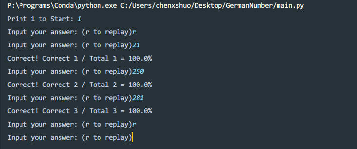

# Listening Practice
Practice listening of German numbers 

## Getting Started 

### Prerequisites 
- `python 3.6`
- `playsound 1.2.2`

```python
pip install playsound
```
### Installing 
```bash
git clone https://github.com/chenxshuo/ListeningPractice.git
```

### Running 

```bash
cd ListeningPractice
python main.py
```

## Examples 

